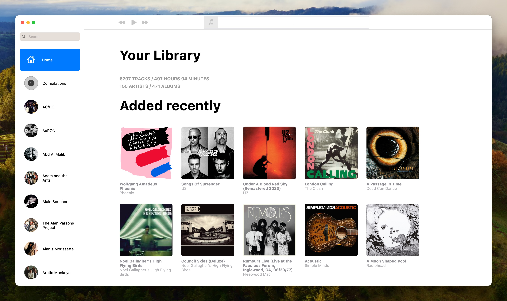
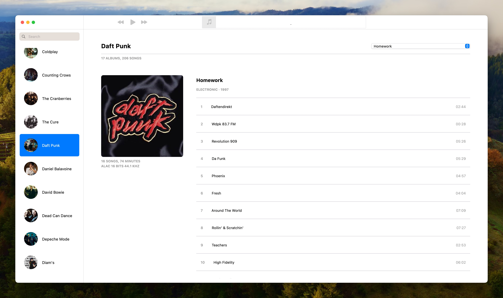

# trax

macOS Music management application written in Flutter.

- Apple Music like UI
- Browse local music files
- Import new files into libraruy (MP3, FLAC, M4A)
- Edit audio tags (including artwork and lyrics)
- Audio format conversion
- Local audio playback





## Getting Started

```
flutter pub get
flutter run macos
```

You can deploy to your `Applications` folder using

```
make deploy
```
